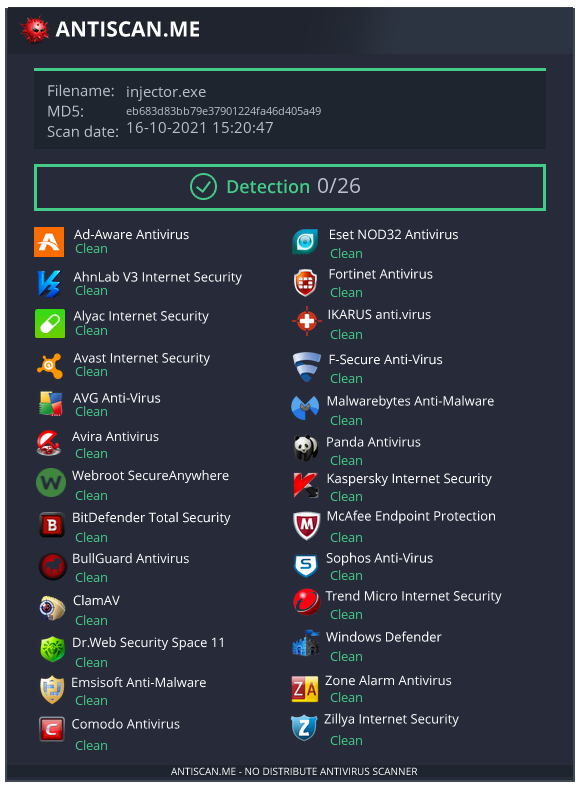

# C++ PE Injector

 
 
 

## Overview

Fully undetectable shellcode injector written in C++ with customizable XOR payload encryption/decryption and basic antivirus evasion functionality.

This project was developed and tested using Dev-C++ 5.11 on a Windows 10 machine using the Meterpreter's reverse TCP payload.

## Building

* First a payload is required for the injector.
* Encrypting the payload is required to make it undetectable by static analyzers. Use the included Python script to encrypt the payload with a key phrase using the XOR method by running: `python xor_encryption.py payload.exe`.
* The generated `payload.h` header file from the Python script needs to be included in the `main.cpp` code file to work. Make sure it is placed in the same folder.
* Compile the project using Dev-C++.
* You're ready to rock!
